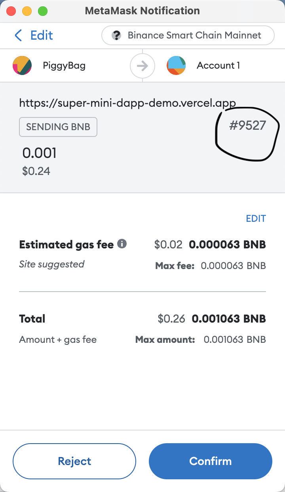

# Super Mini Dapp

#### Preview Link
https://super-mini-dapp-demo.vercel.app/

this is a super mini demo for dapp, written entirely in typescript,  
consist the basic functionality of:
1. read account
2. connect to metamask extension
3. read balance of the native token
4. send transaction to designated address
5. query the result of that transaction
5. read the next nonce
6. ability to modify nonce (it will be ignored by MetaMask anyway)
7. switch network between `Ethereum` and `BSC`

#### About Customized Nonce
customized nonce will be ignored by MetaMask, but it will show at the prompt  
